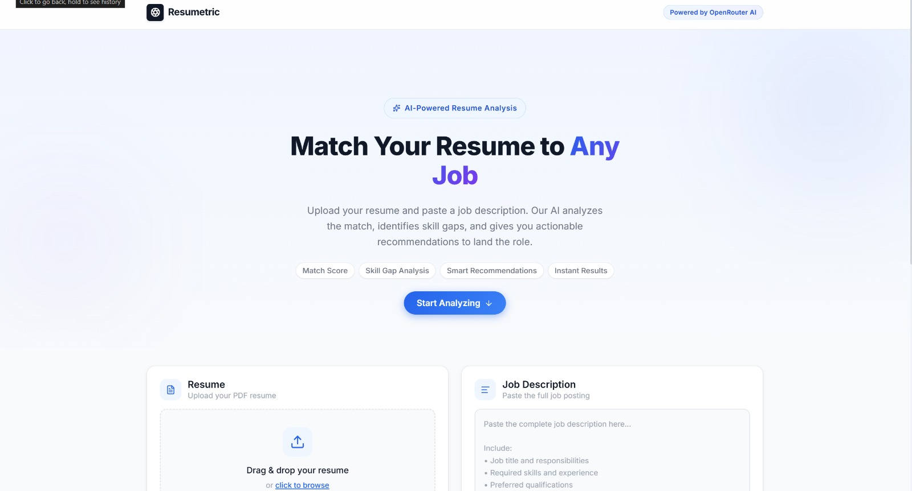
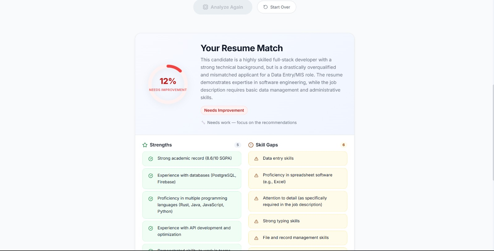
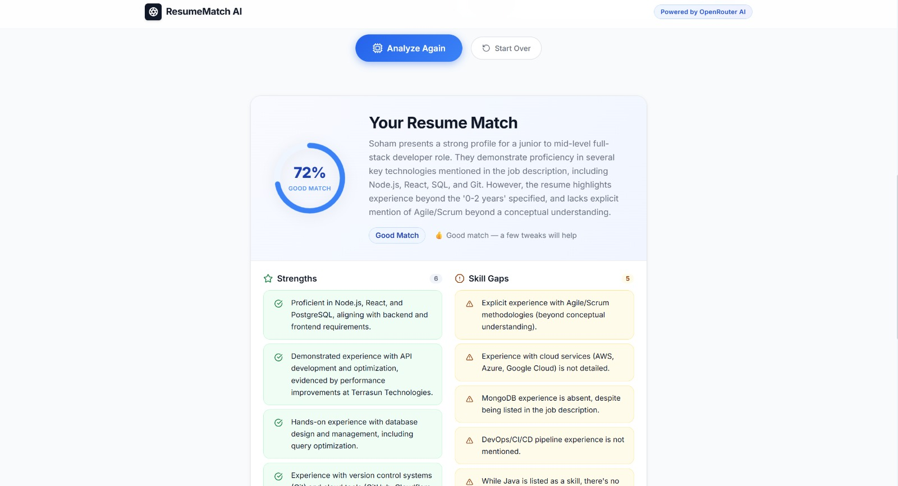

# Resume JD Matcher

An AI-powered Resume–Job Description Matcher that analyzes a candidate's resume against a job description and provides a match score along with personalized recommendations for improvement.

## How It Works

1. Upload a resume (PDF).
2. The backend extracts text using **Microsoft MarkItDown**.
3. The extracted resume content and the job description are sent to the AI model through **OpenRouter API**.
4. The AI returns:
   - Match Score
   - Strengths
   - Areas for Improvement
   - Resume Recommendations
5. The frontend displays the analysis in an easy-to-read dashboard.

---

# Project Structure

```text
resume-jd-matcher/
│
├── frontend/
├── backend/
├── screenshots/
│   ├── SS1.png
│   ├── SS2.png
│   └── SS3.png
└── README.md
```

---

# Prerequisites

* Node.js (v18 or later)
* npm

---

# Installation

## 1. Clone the Repository

```bash
git clone <repository-url>
cd resume-jd-matcher
```

---

## 2. Backend Setup

```bash
cd backend
npm install
```

Create a `.env` file inside the **backend** directory.

Example:

```env
PORT=5000

OPENROUTER_API_KEY=YOUR_OPENROUTER_API_KEY

FRONTEND_URL=http://localhost:5173

MODEL=google/gemma-3-27b-it
```

Start the backend:

```bash
npm start
```

---

## 3. Frontend Setup

```bash
cd ../frontend
npm install
npm run dev
```

The frontend runs at:

```
http://localhost:5173
```

---

# Build

```bash
cd frontend
npm run build
```

---

# Technologies Used

### Frontend

* React
* Vite
* CSS3
* JavaScript

### Backend

* Node.js
* Express.js
* Multer
* PDF Parser

### AI & Document Processing
- Microsoft MarkItDown (Resume Parsing)
- OpenRouter API (LLM Integration)

---
Ensure Python is installed and that the required Python dependencies for **Microsoft MarkItDown** are available if your backend invokes it.

# Screenshots

## Home Page



---

## Match Results



---



---

# Notes

* `node_modules` are intentionally excluded from the repository.
* Environment variables are not committed for security reasons.
* Run `npm install` in both the `frontend` and `backend` directories before starting the application.
